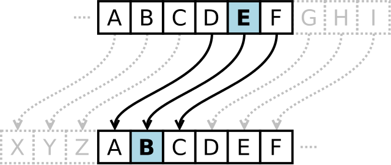

Khy and Thy have been colleague recently. Despite of the short time knowing 
each other, Khy has fallen in love with Thy. As he is too shy to say something directly, he is 
managed to employ `Ceasar Cipher` to write text less readble while still alowing easy deciphering.

Formally, the action of a Caesar cipher is to replace each plaintext letter with a different one 
a fixed number of places down the alphabet. The cipher illustrated here uses a left shift of 
three, so that (for example) each occurrence of E in the plaintext becomes B in the ciphertext.

Given a `plaintext` and `shift` - number of position to shift, return `cipher`

Please help Khy!

Example

`plaintext = "would you like to come with me tonight"`,  
 `shift = 10`
 
 => `cipher = " "`

Input

`plaintext` - text which Khy need to send to Thy

`shift` - number of position to shift

Output
a cipher result from the above instruction. Only lowercase letters are cipherred, other stay the 
same.

Sample input
---------

